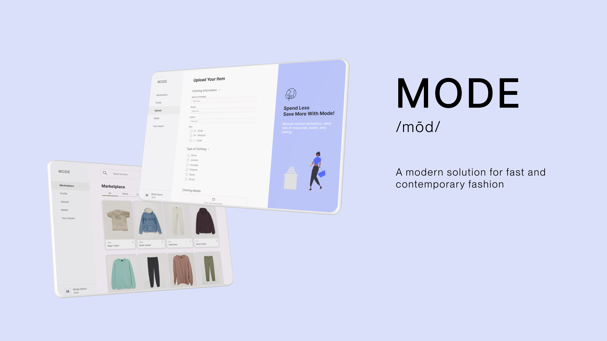

# Mode - nwHacks 2023

## Devpost

## Instructions
1. cd into mode/frontend
2. yarn
3. yarn start
4. You are good to go!

## Inspiration
To build an economically, and environmentally competent solution to combat the growing industry of fast fashion.

## What it does
Mode serves as a marketplace for users around the world to upload their 2nd-hand clothes, minimizing the accumulation of clothes-related waste and increasing the longevity of garment pieces. To perserve the exclusivity of owning the clothes, we rely on Verbwire to mint the clothes uploaded by a user and store them in their own digital wallets. 

## How we built it
Low Fi to Mid Fi to High Fi, async building backend and frontend with a final merge and a lot of challenging issues and learning moments.

## Challenges we ran into
1. Accessing Verbwire API
2. Deployment for Backend

## Accomplishments that we're proud of
We managed to get it up and working through the unforseen obstacles.

## What we learned
Even when you've done something countless times, when it goes wrong it can still be very costly. Never be complacent.

## What's next
Polishing the web app, deploying it more securely, and adding & polishing the features.
